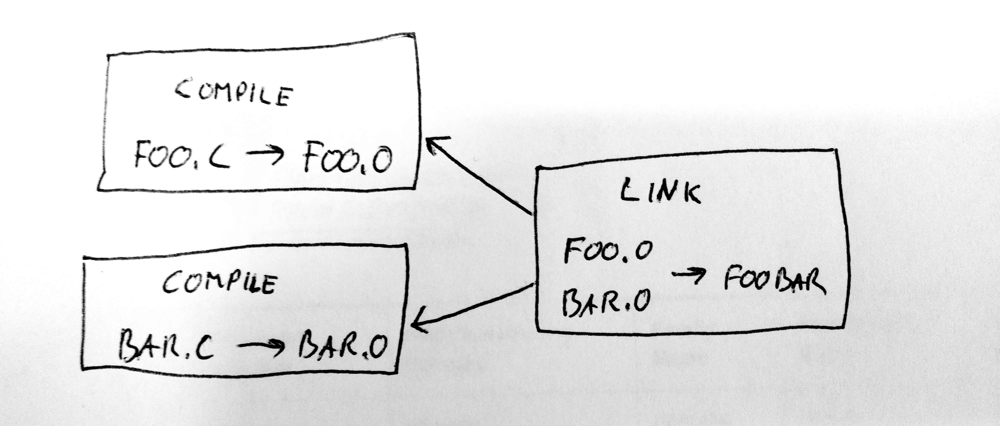
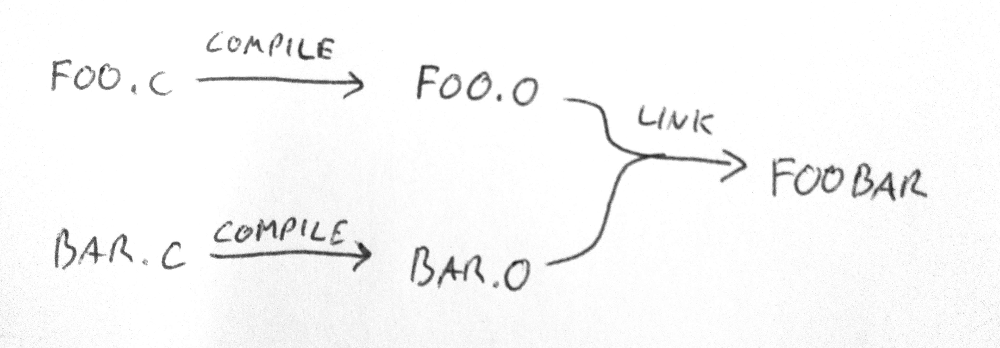

class: center, middle, inverse

# Build systems

## Some thoughts...

Johan Herland < <jherland@cisco.com> >

???

Who am I?

- Platform developer in TC/CE software group
- Currently on the Sunrise project
- Resident Git Guru

---

# Agenda

1. Building software
2. Properties of _bad_ build systems
3. Properties of _good_ build systems
4. The core of a good build system
5. Techniques for improving build systems
6. Conclusions
7. Q&A

---
layout: false
class: center, middle, inverse

# Building software

---
template: default
layout: true

### Building software
---

## Terms
--

- Build process:

    - Generating build outputs from build inputs
    - e.g. building a `carbon.pkg` from a `system-trunk-main` source tree
--

- Build system:

    - The S/W that implements a build process
    - e.g. scripting, `Makefile`s, etc.

---

## Examples of build processes

- Source file &rarr; Executable
- Source files &rarr; Object files &rarr; Executable
- Source files &rarr; Object files &rarr; Library + Executable
--

- Running test suites?
- Creating stripped and/or debug executables?
- Multiple targets?
- Multiple executables?
--

- Autogenerated source files?
--

- Linking against external libs? (prebuilt or not?)
- Subprojects, external dependencies, triggering other build systems?
--

- Collecting executables and libs into a distro package (e.g. `.deb` or `.rpm`)
- Assembling filesystem images?
- Creating upgrade packages (`.pkg`)?

---

## Other examples of build processes

--

- VHDL code + FPGA config/specification &rarr; FPGA image + headers 
--

- Text documents &rarr; web site of static HTML files
--

- LaTeX source &rarr; PDF document

---

## Extracting common concepts

Build process consists of _build_ _steps_.

- Traditional/simple example:
    - `foo.c` &rarr; `foo.o`
    - `bar.c` &rarr; `bar.o`
    - `foo.o` + `bar.o` &rarr; `foobar` executable
    - 3 steps

- Trivial build process example:
    - Run a shell script that does magic &rarr; final output
    - 1 step

---

## Extracting common concepts (cont.)

A build step often _depends_ on other build steps.

- e.g. first compile object files, then link those into an executable
- the linking process _depends_ on the object files
- Therefore: the linking step _depends_ on the compilation steps

--

Organize steps into a directed acyclic graph:

- Nodes are build steps
- Edges are dependencies between build steps

We call this a _dependency_ graph.

---

## Dependency graph

---

## Almost, but not quite a dependency graph

---

## Extracting common concepts (cont.)

Each step has:

- a set of inputs (aka. _dependencies_)
- a set of outputs (aka. build _products_)
- some process that turns inputs &rarr; outputs, e.g.
    - invoking a compiler with appropriate options
    - running a script that does some magic...

---

## Extracting common concepts (cont.)

Steps may be nested:

- Some steps can be split into substeps
    - ( hello.c &rarr; hello.exe ) &rArr; ( hello.c &rarr; hello.o &rarr; hello.exe )

- A group of steps (i.e. a subgraph) can be grouped into a single build step
    - e.g. compiling and linking a library

---

## Building on the concepts

Clean build:
- Full traversal of the dependency graph
- Perform all build steps in the correct order to generate the required final
  output

--

Incremental build:
- Some of the build steps have already been performed
- Determine which steps that need to be redone
- Do only those steps

---

## Defining each step

- What are the inputs?
- What is the process/command?
- What are the outputs?

--

Is that all?

---

## Defining each step (cont.)

What is really the process/command?

- Command line
- Some script/program located somewhere
--

- Which version?
- Command line options?
--

- Environment??
--

- Locale!?

--

If any of them change, the build step must be rerun to be up-to-date.

&rArr; These are actually _dependencies_ of the build step!

&rArr; Add them to the list of inputs.

---

## Defining each step (cont.)

Example #1: Compiling `hello.c` &rarr; `hello.o`:

- Obvious:
    - INPUT: `hello.c`
    - OUTPUT: `hello.o`
    - COMMAND: `gcc -c hello.c -o hello.o`
--
- Not so obvious:
    - INPUT: Compiler command line
        - What if we add `-g` or `-O3` to the command line?
    - INPUT: The compiler itself
        - What if we upgrade GCC or use a different compiler?
    - INPUT: The environment passed to the compiler
        - `$PATH`
        - `$TMPDIR`, `$COMPILER_PATH`, `$LIBRARY_PATH`
        - `$LANG`

---

## Defining each step (cont.)

Example #2: Autogenerating source code:

- 2 build steps:
    1. Generate the source
    2. Compile the source

--

- First build step: Generate the source code
    - INPUT: Some original input source passed to the generator
    - OUTPUT: The generated source
--
    - INPUT: The generator itself
    - INPUT: The command line and environment passed to the generator

--

- Second build step:
    - INPUT: generated source
    - OUTPUT: compiled source
--
    - INPUT: Compiler, its command line and environment

---

## Defining each step (cont.)

Example #3: Building a subproject, e.g. `libfoo`:

- INPUT: A `libfoo` source tree
    - (unpacked from a tarball, or checked out from some git repo)
- OUTPUT: Build products (executables, libraries, config files, etc.)
- INPUT: Command line(s) and environment to build (and install?)
    `libfoo`
--

...but don't forget:

- INPUT: Tools needed to build `libfoo`:
    - compiler?
    - interpreter?
    - its build system (make, cmake, etc.)?

---

## Defining each step (cont.)

Example #4: Assembling a file system image:

- INPUT: The file structure that goes into the FS
- INPUT: The FS generator tool, its command line and environment
- OUTPUT: The FS image

---
layout: false
class: center, middle, inverse

# Properties of _bad_ build systems

---
template: default
layout: true

### Properties of _bad_ build systems
---

Succeeds on machine _X_, but fails on machine _Y_ &mdash; _WHY?_

--

- Possible reasons:
    - Compiler/tool installed on _X_, but not on _Y_
    - Wrong compiler/tool version
    - Depends on a specific OS/distro
    - Depends on specific environment variable(s)
    - Hardcoded user paths: `/home/johndoe/src/main/foo/bar`
    - NFS mount or shared network drive
    - Connectivity to external servers
        - within office/site?
        - within company?
        - 3rd-party site!?
--
- Some of these are known/intentional
    - i.e. fix machine _Y_ - not a build process bug
- However, often most of these are (unknown) bugs
    - just waiting newbies to stumble upon
- Hidden/unknown deps make it harder to setup a machine for building
- External deps are sometimes necessary, but _try_ to reduce/eliminate

---

Succeeds on machine _X_, but fails on machine _Y_

Succeeds on both _X_ and _Y_, but the build results from _Y_ don't work properly!
- Worse!

--

Always build release builds from clean
- Cannot trust incremental builds
- Fast _or_ correct, choose one! &#9785;

--

Slow!
- Unnecessary rebuilds
- Lack of parallellization

--

Obtuse
- Build failures are hard to diagnose and debug

---
layout: false
class: center, middle, inverse

# Properties of _good_ build systems

---
template: default
layout: true

### Properties of _good_ build systems
---

Correct!
- Incremental builds can be trusted
- If build succeeds on two machines, then the build results are
  (bug-for-bug) _equivalent_ (hopefully even _identical_).

---

Correct!

Fast!
- No unnecessary rebuilds
- Rebuild only the smallest thing needed
    - Requires _fine-grained_ build steps
    - Not always possible, e.g. rebuilding Android in `system-trunk-os`
- No unnecessary sleeping or waiting around
- Parallel (when possible)
- Distributed? (exploit parallellism across hosts)

---

Correct!

Fast!

Flexible/portable
- Works across distros/OSes
- Builds correctly everywhere

---

Correct!

Fast!

Flexible/portable

Helpful
- When build fails, it's easy to find out why.
- External resources are checked for _explicitly_
    - e.g. a separate build step that precedes the build steps that use the
      external resource

---
layout: false
class: center, middle, inverse

# The core of a good build system

---
template: default
layout: true

### The core of a good build system
---

## Digression: Functional programming:

- Pure functions
    - All inputs are passed in the function _call_
        - No external state
    - All outputs are passed in the function _return_
        - Again: no external state
    - No side effects!
    - Can be memoized (i.e. cache output keyed on inputs)
    - Can be easily and safely parallellized
- Composing functions
    - use one function's output as input to another function
- Let's apply this to our build steps!

---

## _Pure_ build steps

- No side-effects!
    - All files read (or executed) are declared as inputs
    - All files written are declared as outputs
- Enables safe parallellization of build steps
    - i.e. parallellization _within_ build targets
- Do _not_ rewrite your inputs. Create new files instead...
    - Inputs and outputs are disjoint
- Enable out-of-tree builds
    - Build several targets simultaneously from a single source tree
    - i.e. parallellization _across_ build targets
- Can be cached:
    - Checksum across the input maps to the generated outputs
    - Never build the same thing _twice_!

---

## Control your tools

- Fairly easy with cross-compilers
    - Often isolated to a single directory
    - Seldom _upgraded_, instead _replaced_ with a different cross-compiler
- Try to approach _native_ compilers the same way
    - Make sure a compiler upgrade is auto-discovered and triggers rebuilds
      appropriately
    - Consider doing a checksum of the compiler executable that is verified at
      the start of the build
- The same really applies to all other tools used in the build process
- Consider providing the tools as separate build steps
    - Enable the build process to _automatically_ establish its own environment
    - Homogenic tool set
    - Easy to setup a new build machine
- Alternative approach:
    - Provide Docker image with external dependencies installed.

---

## Digression: Deterministic builds

- Reflections on Trusting Trust (by Ken Thompson)
    - https://www.ece.cmu.edu/~ganger/712.fall02/papers/p761-thompson.pdf
- How can you trust your compiler?
- Solution: Crowdsourcing
- Build on different hosts all over the world.
- If all the build outputs are _identical_, the compiler backdoor exists
  either in _all_ of them (unlikely), or in _none_ of them (likely).
- BUT: Requires a deterministic build process
- Gitian (used by TOR, Bitcoin)
    - http://gitian.org/

---

## Taking things to the extreme

- Make build process deterministic (as far as possible)
    - Same input yields same output. _ALWAYS!_
    - Dealing with randomess/nondeterminism &mdash; there are two kinds:
        - Arbitrary changes: _ELIMINATE THEM!_
        - True/real/necessary randomness: _COMPARTMENTALIZE!_

---

## Taking things to the extreme (cont.)

- Make build process deterministic (as far as possible)
- Distributed build cache
    - Think `distcc` + `ccache`, but for any build step (not just compilation)
    - "If any of my colleagues built it, I should never have to rebuild it!"

---

## Taking things to the extreme (cont.)

- Make build process deterministic (as far as possible)
- Distributed build cache
- Monitor build steps to automatically deduce inputs/dependencies and outputs

---

## Taking things to the extreme (cont.)

- Make build process deterministic (as far as possible)
- Distributed build cache
- Monitor build steps to automatically deduce inputs/dependencies and outputs
- Continuous build process
    - A build daemon that watches your source tree and automatically triggers
      rebuild when any file is changed.
    - e.g. Watchman from Facebook: https://github.com/facebook/watchman

---

## Taking things to the extreme (cont.)

- Make build process deterministic (as far as possible)
- Distributed build cache
- Monitor build steps to automatically deduce inputs/dependencies and outputs
- Continuous build process
- Flip the arrows!
    - Constructing the entire dependency graph is necessary, but expensive
    - However, let's assume you can correctly detect when a build step might
      have changed (and then update the dep graph accordingly)
    - Now, cache the dep graph, but in an alternate/reversed form where inputs
      are mapped (through build steps) to outputs.
    - If input _X_ changes, lookup in this reverse map to find which build
      steps trigger. Repeatedly lookup their (updated) outputs to find further
      build steps to trigger, until the final targets have been rebuilt.
    - Inspiration and further reading:
        - Tup: http://gittup.org/tup/
        - Build System Rules and Algorithms: http://gittup.org/tup/build_system_rules_and_algorithms.pdf

---
layout: false
class: center, middle, inverse

# Techniques for improving build systems

---
template: default
layout: true

### Techniques for improving build systems
---

Some tips & tricks I think may be helpful when examining, debugging, and
improving build systems and build processes:

- `diff`
    - build logs
        - hard when parallellism is involved.
        - hard when build logs contain extra cruft (e.g. timestamps)
    - build results

---

Some tips & tricks I think may be helpful when examining, debugging, and
improving build systems and build processes:

- `diff`
- Tweak the filesystem
    - Make the source tree _read-only_ to see if build is _truly_ out-of-tree.
    - Run build process within a `chroot`/container to precisely control which
      tools are accessible to the build process (e.g. limit access to host
      tools or headers)

---

Some tips & tricks I think may be helpful when examining, debugging, and
improving build systems and build processes:

- `diff`
- Tweak the filesystem
- `strace`
    - on the whole thing? probably not...
    - on individual steps, to help hunt down hidden dependencies
    - which brings me to...

---

Some tips & tricks I think may be helpful when examining, debugging, and
improving build systems and build processes:

- `diff`
- Tweak the filesystem
- `strace`
- `depfinder.py`
    - runs strace on an arbitrary command and reports paths accessed by it
      (and its subprocesses)
    - Future work: Integrate into a build system to automatically flag missing
      dependencies.
    - Further into the future: Extend into a build system that automatically
      discovers/updates dependencies of each build step?
    - https://github.com/jherland/depfinder

---

Some tips & tricks I think may be helpful when examining, debugging, and
improving build systems and build processes:

- `diff`
- Tweak the filesystem
- `strace`
- `depfinder.py`

What are your favorite tricks for debugging build problems?

---
layout: false
class: center, middle, inverse

# Conclusions

---
template: default
layout: true

### Conclusions
---

- Build processes that are slow and untrustworthy can be fixed!

- Work towards _pure_ build steps that are self-contained and without
  side-effects.

- Finding _all_ the dependencies might not be immediately obvious.

- There are tools and tricks to help you along.

- Putting some time into understanding and fixing it is a good investment, both
  for you and your colleagues

---
layout: false
class: center, middle, inverse

# Q&A

---
class: center, middle, inverse

# Thank you!

## Johan Herland < <jherland@cisco.com> >

Slideshow created with [remark](http://gnab.github.com/remark).
